# Flowdex Academy

Flowdex Academy is a production markets-education platform: a typed course system, exams, multi-gateway checkout, and membership areas, built on Next.js (React, TypeScript) with Supabase and deployed on Vercel.

> This is a production product. The repository here is a curated public showcase — secrets, internal tooling, and paid course content are excluded.

**Stack:** Next.js (App Router) · React · TypeScript · Tailwind CSS · Supabase (Auth, Postgres, RLS) · Vercel

## Architecture

```mermaid
flowchart TB
    Browser["Browser — Next.js / React"] --> App["App Router · 43 API routes · server actions"]

    App --> Courses
    App --> Pay
    App --> Tutor
    App --> Data
    App --> Comms
    App --> Ops

    subgraph Courses["Courses &amp; exams"]
      direction LR
      C1["Typed course content<br/>modules · sections · blocks"]
      C2["Zero-trust exam engine<br/>idempotent attempts · cooldown"]
      C3["Progress tracking<br/>+ membership gating"]
      C1 ~~~ C2 ~~~ C3
    end

    subgraph Pay["Payments"]
      direction LR
      P1["MercadoPago · PayPal<br/>NOWPayments"]
      P2["Idempotent webhooks<br/>tolerant fulfillment"]
      P3["Coupons &amp;<br/>affiliate tracking"]
      P4["Dual-currency<br/>pricing (ARS / USD)"]
      P1 ~~~ P2 ~~~ P3 ~~~ P4
    end

    subgraph Tutor["AI tutor"]
      direction LR
      T1["Gemini +<br/>context caching"]
      T2["Prompt-injection<br/>filter"]
      T3["Usage logging<br/>&amp; quotas"]
      T1 ~~~ T2 ~~~ T3
    end

    subgraph Data["Data &amp; auth"]
      direction LR
      D1["Supabase Auth<br/>+ Turnstile captcha"]
      D2["Postgres + RLS<br/>multi-tenant isolation"]
      D3["34 versioned<br/>SQL migrations"]
      D1 ~~~ D2 ~~~ D3
    end

    subgraph Comms["Community &amp; email"]
      direction LR
      M1["Discord bot<br/>role grant / revoke"]
      M2["Telegram bot<br/>admin notifications"]
      M3["Resend<br/>transactional email"]
      M1 ~~~ M2 ~~~ M3
    end

    subgraph Ops["Platform ops"]
      direction LR
      O1["Upstash<br/>rate limiting"]
      O2["Sentry + PostHog<br/>observability"]
      O3["Vercel<br/>deploy · 3 cron jobs"]
      O1 ~~~ O2 ~~~ O3
    end
```

## Features

- Typed course system (modules, sections, and content blocks defined in TypeScript)
- Zero-trust exam engine
- Multi-gateway payments (MercadoPago, PayPal, NOWPayments) with idempotent webhooks
- Row-Level-Security multi-tenant data isolation
- AI tutor (Gemini) with a prompt-injection filter
- Rate limiting (Upstash Redis)
- Observability (Sentry error tracking, PostHog product analytics)
- Discord and Telegram integration

## Notes

- This is a curated public showcase: secrets, internal tooling, and paid course content are excluded.
- Course content files retain their pedagogical structure but the lesson bodies are replaced with placeholders.
- This is not the full production tree.
