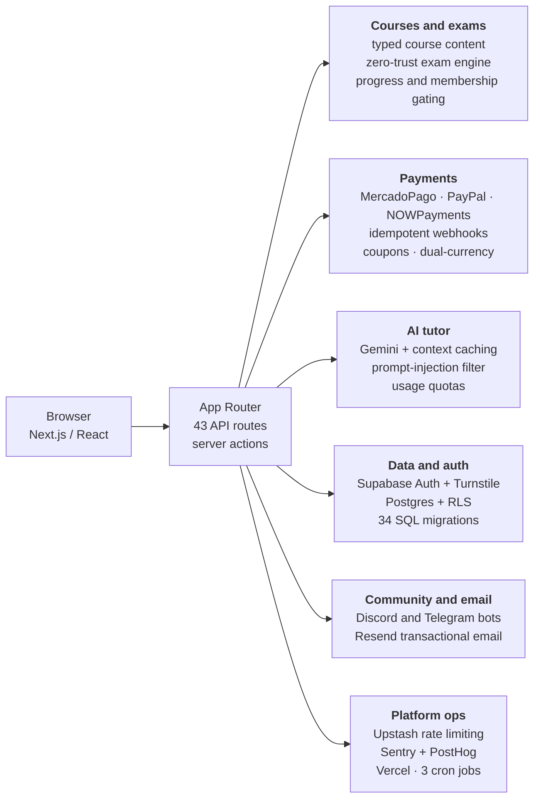

# Flowdex Academy

Flowdex Academy is a **production markets-education platform** — a typed course system, a zero-trust exam engine, multi-gateway checkout, an AI tutor and gated membership areas — built on Next.js (App Router) with Supabase and deployed on Vercel. It runs a real business end to end: students, payments in three currencies, automated email and community access, with full observability behind it.

> This repository is a **curated public showcase**. Secrets, internal admin tooling and the paid course content are excluded; the lesson bodies are replaced with placeholders while keeping their structure. Live at **[flowdex.com.ar](https://flowdex.com.ar)**.

**Stack:** Next.js 16 (App Router) · React 19 · TypeScript · Tailwind CSS 4 · Supabase (Auth, Postgres, RLS) · Vercel

---

## How it works

A single Next.js application serves the public site, the authenticated student area and the backend in one deploy. Server actions and 43 API routes handle the work: checkout and payment webhooks, exam attempts, the tutor, membership grants, and the cron jobs that keep email and access in sync. Supabase provides auth and a Postgres database with Row-Level Security, so each student only ever sees their own data.

## Architecture

## Highlights

**Payments that don't lose money.** Three gateways — MercadoPago, PayPal and NOWPayments (crypto) — behind one fulfillment path. Webhook handlers are **idempotent** (a replayed notification never double-grants access), fulfillment is tolerant of small under/over-payments, and everything is logged. Coupons and affiliate attribution are first-class.

**A zero-trust exam engine.** Attempts are guarded by idempotency tokens and cooldowns, scored server-side, and recorded per student — designed so the client can't be trusted to report its own result.

**An AI tutor on a leash.** Built on Gemini with context-prompt caching to keep latency and cost down, a **prompt-injection filter** in front of it, and per-user usage logging and quotas.

**Multi-tenant by construction.** Supabase Row-Level Security isolates every student's data at the database level; 34 versioned SQL migrations track the schema over time. Auth is hardened with Turnstile and strict security headers.

**Operations built in.** Upstash Redis rate limiting, Sentry error tracking, PostHog product analytics, transactional email via Resend, Discord and Telegram bots for community role management, and three scheduled cron jobs that revoke expired access and drive re-engagement.

## Capabilities

- [x] Typed course system (modules, sections and content blocks defined in TypeScript)
- [x] Zero-trust exam engine (idempotent attempts, server-side scoring)
- [x] Multi-gateway payments with idempotent webhooks (MercadoPago, PayPal, NOWPayments)
- [x] Coupons + affiliate tracking; dual-currency pricing
- [x] Row-Level-Security multi-tenant isolation; 34 SQL migrations
- [x] AI tutor (Gemini) with prompt-injection filter and usage quotas
- [x] Rate limiting (Upstash), captcha (Turnstile), strict security headers
- [x] Observability — Sentry + PostHog
- [x] Discord & Telegram integration; transactional email (Resend)
- [x] Scheduled cron jobs (access revocation, re-engagement)

## Notes

This is a curated public showcase: secrets, the admin panel and paid course content are excluded, and course-content files keep their pedagogical structure with the lesson bodies replaced by placeholders. It is not the full production tree.
